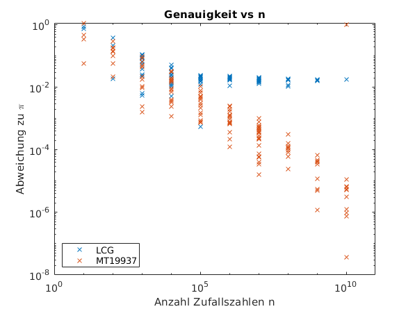
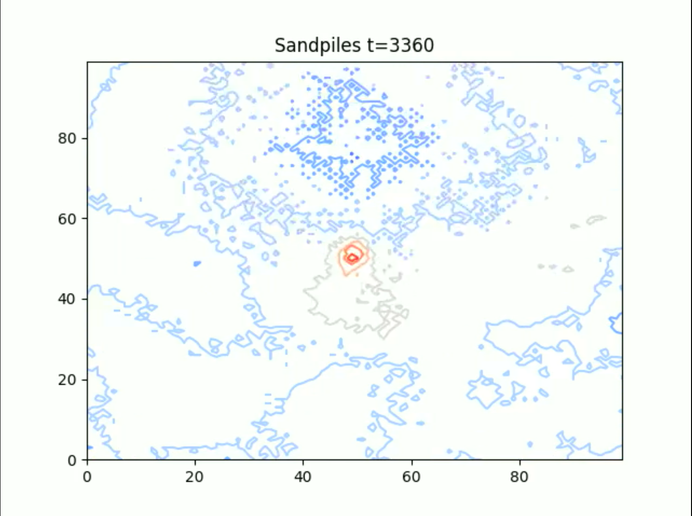
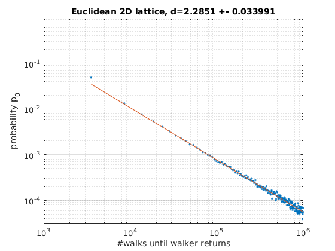
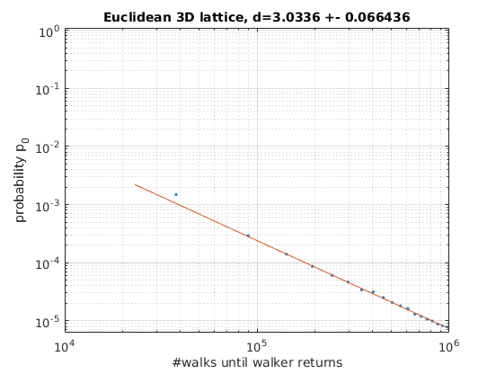
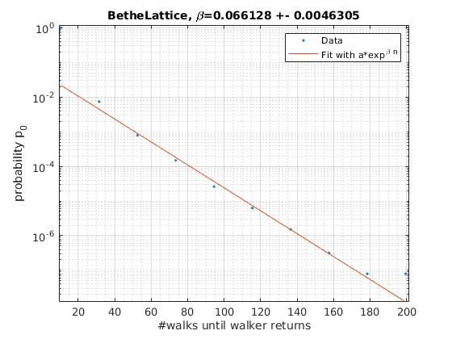
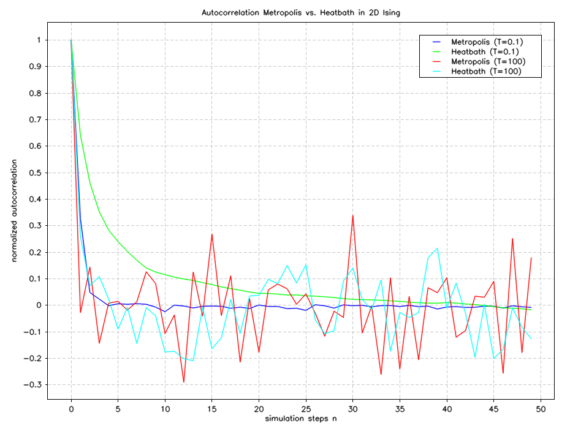

# Projects for the lecture Numerical Methods of Statistical Physics

The lecture was held by Markus Quandt and Giuseppe Burgio in summer term 2020 at University of Tübingen.

The used language for simulations is C++20. The IDE is CLion.
The used build-system is Debian Buster.
It should also work on other platforms with small modifications in CMakeLists.txt.

## Installation requirements

1. CMake https://cmake.org/install/
2. Armadillo http://arma.sourceforge.net/download.html
3. Matplotlib-cpp from https://github.com/lava/matplotlib-cpp

## How to compile?
This is a **CMake-Project**. Compilation and building is pretty easy. Simply run in main folder via terminal:

<code>
cmake --build ./cmake-build-release --target {PROJECT-NAME} -- -j 6
</code>

 For example for building the binary of the fractals-project run:

<code>
cmake --build ./cmake-build-release --target fractals -- -j 6
</code>

The binary is located in `./cmake-build-release/bin/fractals`.
All project names are noted in CMakeLists.txt.

## Unit Tests

Unit-Tests are performed with CTest. Therefore, every project has its own cpp-File with the
nomenclature: `test{projectName}.cpp` in folder `test/ctest`.
There aren't Unit-Test for all projects and functions.

## Testing different random-number-generators (RNGs)

I did a pi-Test with 2 different random number generators (RNGs). The program can run in a fully parallelized mode.

The RNGs were used from standard C++ header `Random.h`.

We can see the convergence of the **Mersenne-Twister MT19937** algorithm with

up to 1E10 random numbers per calculated point. Convergence doesn't seem to slow down until 1E10, so I assume we can
calculate pi more exactly with more time. The maximum period of random numbers of MT19937 is pow(2,19937)-1, so this
would be a thinkable limit.

The **linear congruential RNG** (LCG) is limited in randomness and periodicity which results in limited convergence. With
this RNG it is not possible to determine pi more exactly than to 1E-2.

## Forest Fire Simulations
There are some interesting Simulations of Forest-Fire-Cellular-Automatons:

https://people.sc.fsu.edu/~jburkardt/c_src/forest_fire_simulation/forest_fire_simulation.html

https://perso.u-cergy.fr/~ahonecker/bs/software/forest2d.html

## Sand Piles

Main idea from https://www.hiskp.uni-bonn.de/uploads/media/sandpiles.pdf.

**SandPiles** is a simple cellular-automaton where one can observe the collective behavior of falling sand on a field. The
boundary conditions are open in these implementations. You can start with a random distribution of piles of sand or
define one on your own.

The collapse condition of a sand pile is, when the max difference in height to a *von Neumann neighbour* exceeds the
specified `criticalSlope`. So different systems can be simulated.

The program outputs figures generated by https://github.com/lava/matplotlib-cpp.
`matplotlib-cpp` depends on a python-pipe which generates plots by the `matplotlib`. I think this is the cause of the
slow generation of the images. Maybe one can accelerate the process with a c++ only plotting library or simply
generate `bmp`-files.

The final animation is produced by commandline `ffmpeg -framerate 25 -pattern_type glob -i './sandPiles/*.png' out.mp4` which
generates a `.mp4`or`.gif` from all `.png` files in the folder.

A small impression as gif with a random initial setting and always add one sand in the middle of the field.
There are more simulations, also in better quality in `./Projects/SandPiles`.

## Calculate spectral dimensions of fractal structures
Interesting literature:

https://hal.archives-ouvertes.fr/file/index/docid/232136/filename/ajp-jphyslet_1983_44_1_13_0.pdf

https://link.springer.com/content/pdf/10.1007/BF01011791.pdf

This project can calculate spectral dimensions of arbitrary fractal structures.
Each fractal structure inherits the class `WalkableGraph`.
This virtual class provides all methods needed to start a multi-core-simulation to calculate the spectral dimension.

The simulation works as follows: Multiple random walkers were spawned at a defined start-point in the `WalkableGraph`.
After that, we let the random walkers move randomly from one neighbour to another.
When a walker comes back to the start-point, we write the number of performed steps to a `.tsv`-file.

We use the mathematical theorem, that  the recurrence-probability `p_0` of a random walk on a graph should follow
for large amount of steps `n`

<code>
p_0=a*n^{d/2}
</code>

where `a` is an arbitrary constant and `d` is the searched spectral dimension.

To create a new fractal structure one has to provide a new class which inherits from `WalkableGraph`.
A constructor for the class has to be written. Furthermore, on has to add the method `hopToNeighbour(unsigned int n)`
which describes to which neighbour a walker can hop from its actual node.
The `unsigned int n` is a random number between 0 and `amountOfNeighbours` specified in the super-constructor.
The used RNG is the MT19937 from `<Random.h>`.

### Simulation results
#### 2D Euclidean lattice
In this simulation we observe 8E5 random walkers while walking on a 2D euclidean lattice.
We normalize the resulting histogram of comebacks and draw it in a loglog-scatter-printToConsole against the number of steps.

One observes the following printToConsole:

The expected spectral dimension od a 2D euclidean lattice is 2. But in this simulation we observe 2.29 with a small
statistical error! This is an effect of auto-correlations. These occur because we measure not only the probability
for coming back one time from start-point to start-point, moreover we measure the probability for coming back twice,
three-times and so on. So every next measurement is influenced by its predecessors. This results in awful
auto-correlation-times and as a consequence in large systematical errors.

#### 3D Euclidean lattice
In this simulation we observe 4.6E7 random walkers while walking on a 3D euclidean lattice.
We normalize the resulting histogram of comebacks and draw it in a loglog-scatter-printToConsole against the number of steps.

One observes the following printToConsole:

The expected spectral dimension od a 3D euclidean lattice is 3. We can observe this in our simulation because the
systematical errors due to auto-correlations aren't that high. This is a consequence of the lower comeback-rate in 3D.

#### Bethe lattice
In this simulation we observe 12.6E6 random walkers while walking on a Bethe-lattice.
A short description what a Bethe-lattice is can be read on Wikipedia.
We normalize the resulting histogram of comebacks and draw it in a semi-log-scatter-printToConsole against the number of steps.

One observes the following printToConsole:

It can be stated that a Bethe-lattice does not satisfy the above law for 'normal' graphs with a power law.
On the contrary, one can see that there is an exponential dependence here with

<code>
p_0=a*\exp^{\beta n}
</code>

One can therefore conclude that the spectral dimension diverges towards infinity.

## Solve the travelling-salesman-problem (tsp) with a simulated annealing algorithm
The code from this project is as stub. The working code can be viewed in another repository https://github.com/Babalion/simulated-annealing-tsp.

## Ising Model
### 2 Level System
You can run a spin-system with N² 2-level spins at a given temperature. You can view the system live via openCV.
An example is shown here:
....

We simulated the system with the metropolis-algorithm and the heatbath algorithm.
We measure the autocorrelation of the resulting energy-series.
For the Metropolis-algorithm we performed 100 sweeps for each new step n+1.
For the heatbath-algorithm one sweep corresponds to n+1.
The correlogram shows impressively how superior the Heatbath-algorithm is to the Metropolis-algorithm if temperature is low.
Thermalization-process
If temperature is high, for both algorithms we could not identify statistically significant autocorrelation.

### Sigma-Model
This is an Ising-Spin-System on a square lattice where every spin can direct in an arbitrary angle in 2D.
One can thus parametrize each spin via angle `theta`. You can also view the simulation live via openCV. Example below:

....